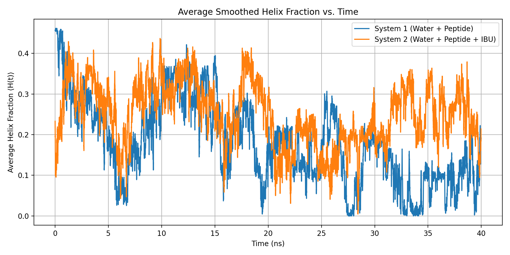

# Aβ16–22 Molecular Dynamics Structural Analysis


## Quick Start

Clone and run the full analysis pipeline:

```bash
pip install -r requirements.txt
python run_analysis.py
```

All figures and analysis outputs will be generated in the `results/` directory.

## Overview

This project analyzes molecular dynamics (MD) simulations of the Aβ16–22 peptide under two conditions:

- **System 1 (S1):** Peptide in explicit water  
- **System 2 (S2):** Peptide in water with ibuprofen  

The objective is to quantify how ibuprofen influences peptide structural stability and compare structural behavior between systems using reproducible computational analysis to compare to current simlar research.

All analysis is automated via Python scripts and organized into a reproducible computational pipeline.
---

## Methods

Secondary structure assignments were obtained using **STRIDE** via VMD from NAMD production trajectories.

The following quantitative metrics were computed:

- Helix fraction per frame (H, G, I codes)  
- Smoothed helix fraction trajectories using moving average  
- Average helix fraction across 5 independent trajectories  
- Standard deviation and standard error across all frames  
- Residue-level contact frequency with ibuprofen  
- Potential energy stability analysis  


All scripts operate using a portable directory structure:

```
data/raw/ → input STRIDE and contact files
results/figures/ → generated plots
results/tables/ → computed statistics
```

## Key Result: Average Smoothed Helix Fraction



This figure shows the time evolution of the average smoothed helix fraction across five trajectories for both systems.
---
## Project Structure
```
abeta-22-md-analysis
│
├── src/ # Python analysis scripts
├── scripts/ # Supporting analysis scripts
├── data/ # Raw and processed data (not tracked in GitHub)
├── results/ # Generated figures and tables
├── run_analysis.py # Master pipeline runner
└── README.md
```
## Reproducibility

To reproduce the analysis on your own machine:

```bash
pip install numpy matplotlib
python run_analysis.py
```

Outputs will be generated automatically in the `results/` directory.
## Technologies Used

- Python  
- NumPy  
- Matplotlib  
- NAMD molecular dynamics engine  
- VMD visualization software  
- STRIDE secondary structure analysis  
- Scientific computing and data analysis workflows  
---

## Scientific Significance

This computational analysis quantifies how ibuprofen influences structural stability of amyloid peptide segments. These methods are directly applicable to studying peptide aggregation, structural dynamics, and molecular interactions using molecular dynamics simulations.

This project demonstrates reproducible computational biology analysis, scientific data processing, and quantitative structural analysis using Python.
## Author

Nicholas McMahon  
